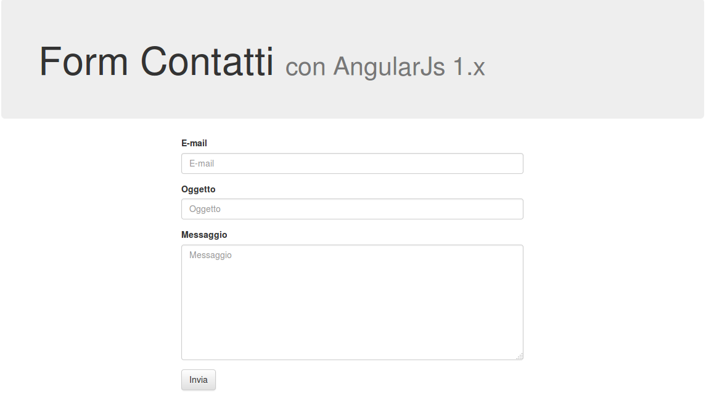
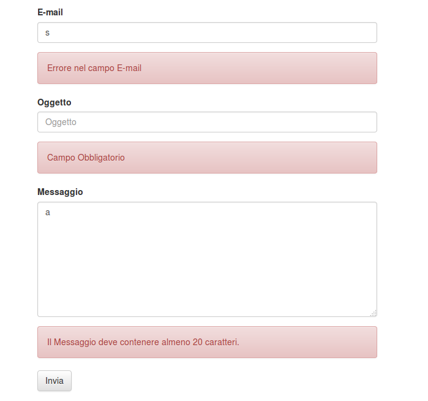

# Simple AngularJs Contact Form

Semplice Direttiva per AngularJs 1.x con un server minimale scritto in NodeJs.

[Link All'articolo](http://www.javascripters.it/2016/05/23/angular-js-1-x-creare-un-form-contatti-riutilizzabile-le-direttive/)

## Come usare

node server.js

## Schermata di esempio

## Schermata di esempio con errori

